# 6.08 Final Report - Team 33

👋

### Hey 6.08 Staff!

Below is the explanation of Team 33's final project. Thank you for all the work you did and the support you gave us, we really appreciate it!

**Enjoy!**

Team 33 (Tommy Heng, Isabella Kang, Daniel Vuong, Karen Gao, and Anushka Nair)

# Table of Contents

# What is JoeBox Games - Bluffalo?

Bluffalo is a bluffing multiplayer party game supporting up to six players connected to a shared web server. There are three rounds (first two rounds have three words, and the last "final" round has one word), where in each round, an obscure word and its definition is randomly chosen from a predetermined pool of words, where one word in the definition is blanked out. Players must use their ESP to enter a word that they believe appears legitimate. If a player happens to enter the correct answer, they are informed of this and encouraged to enter a false answer. The shared server then presents all players’ answers as well as the correct answer. Players must select the answer they believe to be correct. A player scores points by selecting the correct answer, or by having other players select their fake answer.

# Video Demo

[https://youtu.be/5p--cW7tbzc](https://youtu.be/5p--cW7tbzc)

# How Do You Play the Game?

## The Game

The players have an ESP and the Webpage (tiny.cc/joebox) open. On the ESP, one player (the host) creates a room, which automatically generates a room code. That room code is then shared with all the other players in the game, who enter the room code into their ESP and the webpage. After entering the room code, the players enter a lobby. When all the players join the game and are ready to start, the host can start the game by clicking the "Start Game" button. When the game starts, the players are given an obscure word (eg. anthomania) and the definition of the word with a blanked out word (eg. _____ with flowers). The players in the game all enter a guess on their ESPs for what the blanked out word is. Once everyone has submitted, the game allows players to vote on which submission they think is the correct answer. The idea is that the players are attempting to guess what the real blanked out definition is. Obviously, the players are not allowed to vote for their own submissions. After the players vote, they are assigned points. Each player receives 1000*(round number) points for selecting the correct answer, and 500*(round number) points for each player who votes for their answer. At the end of the game, the player with the most number of points is the winner.

## Assumptions

- Players are only accessing the game through ESP32 using our software.
- Each player has access to an ESP32 and the internet.
- Players have a way of communicating the room code to each other outside of the ESP32.

## System

## Hardware

- ESP32 Dev Kit
- Breadboard
- IMU (Gyroscope)
- Buttons (2)
- 1.4" TFT LCD Screen

## Software

- Static website (HTML, CSS, and JavaScript files) for Github page
- Server on the 6.08 site ([https://608dev-2.net/sandbox/sc/team033/bluffalo/server.py](https://608dev-2.net/sandbox/sc/team033/bluffalo/server.py))

# Game Functionality

## Server

### Preprocessing - Obtaining the Words to Play the Game

One of the things we needed for the game to work was the list of words for which the players would try to guess the parts of the definitions for, as well as the definitions. First we had to find and store a list of obscure words and their definitions. Then, we had to identify the word we wanted to take out of the definition and have the players guess. Lastly, we had to store these words in with their definitions with the blanked out word and the word that the players would guess.

In order to find obscure words, we needed a method of obtaining them and adding them to the server. Obscure words were found from the site [Phrontistery](http://phrontistery.info/), which contains a dictionary of 17,000 unusual English words. It contained a separate dictionary for words starting with each of the letters of the alphabet. We used beautifulsoup to scrape each of the 26 dictionary website links for its table containing a word and its associated definition, then saved each of these dictionaries in a separate file. Finally, we concatenated all the files together using a unix cat command to form the uncleaned database (a text file), filled with each of the 17,000 words and definitions, separated by a ‘=’.

Now, we needed to clean the database of words that we scraped from the web. In order to do so, we cleaned the words by processing common phrases, then filtering out words with definitions that were too long, or contained irregular phrases causing recognition difficulty for the Rake-NLTK library. Finally, we used Rake to extract keywords from each of the definitions, after carefully manually replacing some suboptimal keywords. Finally, we saved first to a text file, then inserted the words, definitions without the answer, and the answer into a database.

### File Descriptions

- **raw_full_dictionary.txt/raw_dictionary_by_letter**
    - The words and their definitions were scraped off the internet and then stored as word=definition. The words were then stored and separated by the letter they started with (for example a_words.txt). In each file, a word be stored as word=definition (for example aardwolf=South African carnivorous fox-like quadruped).
- **bluffalo_words_with_blank.txt**
    - Each line in this file represents the final list of words, their definition with a blank for the hidden word, and the hidden word. Each of these words were carefully chosen so that the definition wasn't too long, and contained at most one hard-to-guess key word. These words form all the words of our final word bank, and consists of more than 4000 words.
- **word_cleaning.py** - Performed the word cleaning methodology explained above
- **Insert_words_db.py**
    - Takes the words from **bluffalo_words_with_blank.txt** which are in the form *word = definition with a blank where the missing words is = missing word* (for example adoral=_____ the mouth=near). It splits these into three variables, word, meaning, answer, using the '=' as the delimiter. Then it enters those three variables for every word in **bluffalo_words_with_blank.txt** into the database **word_bank.db** (see databases) in the corresponding column.

### Block Diagram

-1.jpg)

### Server Functionality

The players start in the **LOBBY** state. They are prompted on the ESP to add a username and choose to either create or join a room. A room is created and added to the database bluffalo.db and the users are added to that room. The database states the room is in the lobby. They choose either one, and wait for the other players to join the room. When the host (the person who created the room) hits a button on the ESP, the players move to the **BLUFF** state.

The players are now in the **BLUFF** state. A word, meaning, and answer are pulled from the word_bank.db database through a GET request. Players are given a word, the definition of the word with a blanked out word, and they are asked to guess what the blanked out word is. They all submit a guess to the server. The server checks if the guess is the actual answer, and if so asks the player to resubmit. If it is not the "right" answer, the players submission is added to the value associated with their username key in the players dictionary. The boolean submitted in that value is switched to true and their submission is stored. After every person submits, the server checks if they are the last person to submit. After everyone has submitted the players go to the **VOTING** state.

In the **VOTING** state, the ESP is sending GET requests asking the server state. The server returns all the bluffs excluding the bluff that specific player submitted (preventing them from voting for themselves). When the player votes, their vote is sent in a POST request to the server. After every player has voted, they go to the **SCORE** state.

In the **SCORE** state, the players are scored and ranked. This is data is returned and displayed on the ESP and the Webpage (the scoring is as described above). This state times out. If the this is the last state, the players are returned to **LOBBY**. If it is not the last round, the players are returned to **BLUFF** state.

### Databases

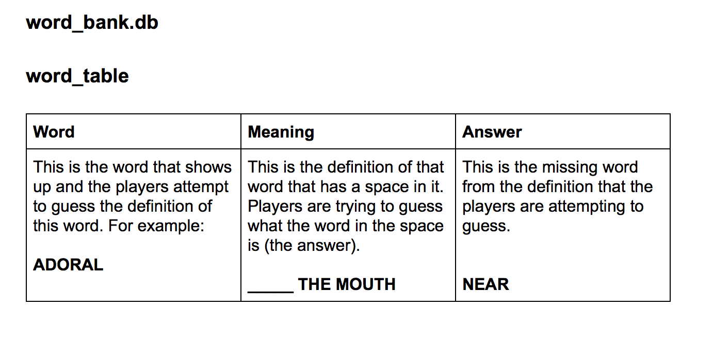

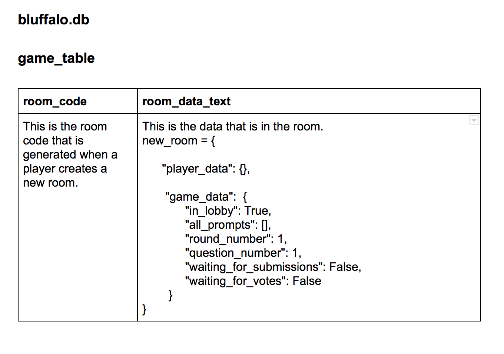

### File Descriptions

- **create_room.py** - this creates the room when the players decides to create the room on the ESP. It enters this room into the game_table.db, described in the Database section. It also generates the room code. The form of the room is as below.

```python
new_room = {
      "player_data": {},

      "game_data": {
        "in_lobby": True,
        "all_prompts": [],
        "round_number": 1,
        "question_number": 1,
        "waiting_for_submissions": False,
        "waiting_for_votes": False
      }
    }
```

- **current_prompt.py** - given a GET request with the room code in the form a of a string *room_code* it returns a string in the format *"WORD=PROMPT."*
- **delete_room.py** - given a POST request with with the room code in the form a of a string *room_code* it deletes a row of data from the SQL Database. Returns if the deletions was "Successful" or if there was "No Room with Room Code"
- **dump_data.py** - Given a GET request, it is optional to enter a room code, it returns large json string representing an array containing [room_code, room_data] pairs. If given a room code, it is only for the room. If not, it returns all of them. For example: [["ABCD, {....}], ["EFGH": {nnnn}, ....].
- **game_check.py** - this code does two different things. In the function **room_code_check,** given a GET request with a room code it returns a boolean representing if the room exists. In the function **in_lobby**, given a GET request with a room code, it returns whether or not in the game is in the lobby.
- **get_bluffs.py -** This file requires GET request with the room code and the option to to enter a username. If a username is entered, that user's submission and any other matching submissions are not included in the output (This is explained above. This prevents the user from voting for their own submission). This returns a comma separated string of bluffs in alphabetical order.
- **get_scores.py -** The input is a GET request with the roomcode. The code traverses all the player data and returns a comma separated string. Every even numbered item is the players name and every odd number item is the score of that player that precedes it. The output is a comma separated string of players and their scores (Ex. "Username1, 100, Username2, 200,....").
- **list_players.py -** Returns a comma separated strings of all the players in a certain room.
- **score_rank.py -** Returns a comma separated string of players along with their scores, sorted from highest to lowest score in a room. Essentially, this ranks the players. (ex. "Username1, 30, Username2, 15, Username3, 10").
- **[server.py](http://server.py) -** This file contains a function that initializes a new database under 'bluffalo/game_data.db' if it does not exist and insert into the table an empty room with room code "ABCD" as an example room for one sample game. This file is basically a hub that contains all the GET and POST methods such as 'submit_bluff' or 'vote' under 'action' for all GET and POST requests that involves the server.
- **vote.py**
    - Input is the room code, user, and their choice. If the user submits something that is the right answer, they are asked to resubmit. If not it returns the number of people who haven't voted yet this round indicating the vote was successful. (ex. "There are 2 player(s) who have not voted this round'
- **waiting_for_submissions.py -** This tells us whether we are in waiting for bluff submissions. This checks if the value of game_data under waiting_for_submissions is True.
- **waiting_for_votes.py -**  This tells us whether we are in waiting for voting submissions. This checks if the value of game_data under waiting_for_votes is True.
- **game_check.py**
    - For the sake of demonstration, the server’s game_data.db is initialized with one room. The room code is “ABCD” and the game_data for this room is the following way. There is a dictionary with two keys: **player_data and game_data.** The **player_data** key's value is a dictionary with the players username as the key. Their value is another dictionary. The keys in this dictionary are *score, submitted,* and *submission.* The value of score is an integer that represents that players *score* in the game. *Submitted's* value is a boolean that says whether they submitted a bluff or not. *Submission* is the submitted bluff text that the user submitted as an answer. The **game_data** keys' value is a dictionary. The keys are:
        - in_lobby : boolean that states whether the game is in the lobby (ex. False)
        - current_word : the current word the players are guessing about (ex. acinaceous)
        - current_meaning : the definition with a blank that the players see (ex. full of ________)
        - current_answer : the blanked out word the players are guessing (ex. kernels)
        - round_number : the round the game is in
        - question_number : the question number in the round the game is in
        - waiting_for_submission : boolean that states whether the game is waiting for the players to submit.
        - selection_options: boolean that states whether the game is waiting for the players to vote
- **word_prompt.py**
    - This returns the current word in the database corresponding to the submitted room code. We created a handler in word_prompt.py that is imported into [server.py](http://server.py/). The handler current_prompt will return the current prompt for the room corresponding with the provided room_code in the format “<word>=<definition with blank>.”, which it obtains from a GET request to the server.
- **submit_bluff.py**
    - This function processes a post request that includes in the body their room code, a player’s username for the game, and the word they just submitted on their ESP in the current round. This function fetches all the player and game data in the online database table for the room code submitted and converts that json string into a python dictionary and set the ‘submitted’ and ‘submission’ variable for the current player with that username to true and their bluff submitted, respectively, to show that this player has submitted a word along with the word they just submitted. Then we look through all the players under player_data in the all player and room data dictionary from the table and check if all current players have submitted something and count the number of players who haven't submitted a word.
    - If everyone has submitted, we set the waiting for submissions and selection options variables under game data to be false and true respectively. At the end we wanna return the number of players who have not submitted a word this round if we successfully added the player and their bluff to the table using a try and except statement and return ‘None’ otherwise.
- **join_room.py**
    - Given a post request consisting of a room code in form of string and a player’s username also consisting of a string, we want to fetch the player and room data from the online table database for when the room code is the room code in our post request. First I loaded the json file into a python dictionary using the json.load function from the json import and set that room player data score for user to be 0 since the player just joined the roo so we need to initialize the player in our dictionary or json file on the online database table. We also wanna initialize ‘submitted’ for this user to be False and ‘submission’ None since the game hasn’t started yet so therefore everyone starts with these variable states at the beginning.
    - Then, we update our SQL table with our new room dictionary after inserting the new player into our player data sub dictionary in the player and room data main dictionary. Finally we change this dictionary into a json file using the json.dump function and reinsert it into our online table by replacing the old json file for the current room code using the update and set functions where roomcode = room_code from the POST request.
    - Finally, we want to return a list of all players currently in the game by looping through the players in room[‘player_data’] and adding them to a list. I formatted it so that the player user names are separated by a single comma without the quotation marks by using a for loop. Upon the POST request, we get to see a list of players currently in the lobby by looping through all the players in the table currently including the player that just joined the room (which triggered the post request for the join room function). ***players = [player for player in room['player_data']] #code to retrieve all players currently in lobby***
- **start_game.py**
    - The goal of this deliverable is to set the in_lobby to false when the POST request is sent to the server. This way, once the game has started, no new players can join the game.

### Justification

Our server has a straightforward design where each type of POST or GET request is handled independently in a separate file, then imported into **server.py**. Each "action," such as creating a new room or submitting a bluff, has its own file that dictates how the action is to be completed. In the overall state machine, each state performs some subset of these actions.

## ESP32

### Block Diagram

-1.jpg)

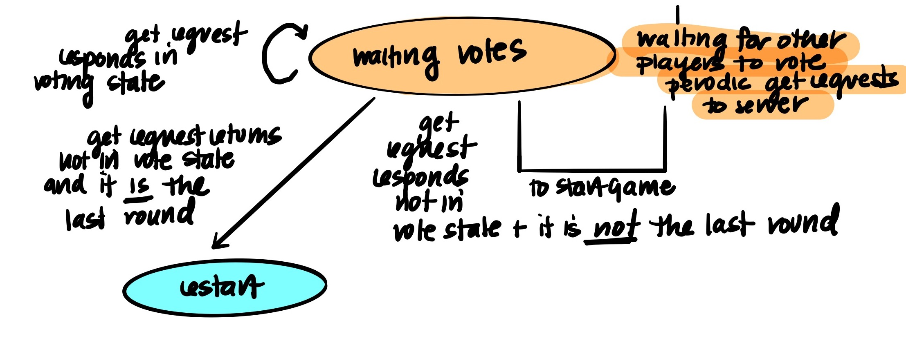

### ESP Functionality

The Server transfers between 13 different states **(START, MAIN, LOBBY_HOST, JOIN, LOBBYGUEST, STARTGAME, CREATE, INPUTUSER, VOTE, SCORE, WAITINGSUBMISSION, WAITINGVOTES, OLDUSER, RESTART)** as the player plays the game. The states of the ESP are meant to respond and follow the states of the server. Often, the actions of the player on the ESP affect the servers states.

The game starts with the player in the state **START.** While the player is in the **START** state, a buffalo in pixel art is displayed (art.ino). The player then presses a button. If the player presses the button and there is persistent memory storage on the ESP, it goes to the state **OLDUSER**, if there isn't persistent memory storage on the ESP, it goes to the state **INPUTUSER.** This is because of the edge case we identified in which the player gets kicked out/disconnected from the game while the game is in progress. In essence, when the player joins a room (is this when?) the username the player chooses and a specific token is stored on the ESP. In that case, if the player is kicked out of the game in the middle, they can restart the game and are given the option to reenter the game with the same username they had as before.

If the player is kicked out in the middle, and has persistent storage, they enter the **OLDUSER** state. In this state, they are told that they found the username **USERNAME** in memory and they ask the player if they want to use that same username. If they do, the player hits button 1 and enters the class **MAIN.** If the player does not want to use the same username/left the game on purpose or some other reason for not wanting to resume, they click button 2, and enter the class **INPUTUSER.**

If the player is a new player and there isn't any persistent storage, they enter the class **INPUTUSER,** in this class, they are prompted to enter their username using the gyroscope method (explained in Gyroscope Letter Input below). Once they have entered their username, they long press the button.  This transitions them to the state **MAIN.**

In the state **MAIN,** the player is asked if they want to create a room or join a room. The player uses button 1 to scroll through the options, and button 2 to select the option they want. After they press button 2, if the player decides to create a room, the server generates a roomcode and sends them to the state **LOBBYHOST.**

In the state **LOBBYHOST,** the player sees their roomcode and the usernames of all the people in the room on their ESP. They can hit button 1 to start the game. The player in this state, the host, is the only one who can start the game. Once they hit the button they go to the state **STARTGAME.** Additionally, by doing this, they send a post request to the server to change the state of the game from **LOBBY** to **BLUFF.**

If the player is in **MAIN** and they decide to join the room, they are given the chance to enter a roomcode. When the enter the roomcode they want, they transition to the state **LOBBYGUEST.**

Once the player is in the state **LOBBYGUEST,** they see on their ESP the roomcode and every user that is in the room. Guests in the lobby cannot start the game. To know when the game is started, the ESP sends get requests periodically every *lobby_timer* milliseconds to check the state of the server. If the state of the server is still **LOBBY,** it stays in **LOBBYGUEST**. If the state of the server is **BLUFF,** then it moves to the state **STARTGAME**.

The next state **STARTGAME** corresponds to the **BLUFF** state on the Server. Essentially, the person is given the word and the meaning with a blank. The word in the blank is what they are guessing. To enter their bluff, they use the gyroscope, and long press to submit their answer to the Server through a post request. In the case that the answer is the same as the right answer, they are asked to resubmit. Once they have successfully posted their answer to the server, they enter the state **WAITINGSUBMISSIONS.** Everytime someone submits their bluff, the ESP checks if this is the last person to submit. If they are, the server state changes from **BLUFF** to **VOTE.**

In the state **WAITINGSUBMISSIONS,** the user is waiting for the all the other players to submit their answers. To figure out when all the users have submitted their answers, the ESP sends constant get requests to the server to ask for its state. If the server state is still **BLUFF**, the ESP stays in **WAITINGSUBMISSIONS.** If the server state is **VOTE**, the **ESP** moves to the state **VOTE.**

In the state **VOTE**, the ESP mirrors the same logic as **STARTGAME** and **WAITINGSUBMISSIONS.** The ESP sends a get request with the room code and username. It asks for the options the person has to vote on. The username is given because the ESP does not display the answer that specific user submitted, preventing them for voting for their own answer. The player then votes on what they choose. When the submit their vote by pressing a button, this sends a post request to the server, and they are transferred to the **WAITINGVOTE** state. Everytime someone submits their vote, the ESP checks if this is the last person to submit. If they are, the server state changes from **VOTE** to **SCORE.** Votes are submitted as a simple integer, corresponding to their choice. Since the choices are sorted in alphabetical order by the server it is ensured that the choices are consistent.

In the **WAITINGVOTE** state, the ESP is sending constant requests to find out what state the server is in. It is waiting for all other players to vote. If the server state is still VOTE, the ESP stays in **WAITINGVOTE.** If the server state is SCORE, it transfers to the next state. There are two states it can go to. It checks if this is the last round by sending a get request to the server and checking the round number. If the round is 7, the last round, the score is then printed to the screen, then it goes to the **RESTART** state, prompting the user for an input. If the round is not 7, meaning it is not the last round, it goes to **STARTGAME.**

In the **RESTART** state, the ESP is waiting for an input from the user, in order to signal a restarting of the game. If the user was originaly the host of the game, an input would place that user into the **LOBBY_HOST** state and otherwise, the user would be placed into a **LOBBY_GUEST.** From either of these states, the round number is reset, and the game then resumes the normal flow.

### Gyroscope Letter Input

The first thing we had to do was figure out how to input the words into the ESP. For this, we decided to use the gyroscope and fancy button class, which distinguishes between short presses and long presses, to allow players to input letters for words and long press to submit their word, which sends a post request to the server. The functionality works where the player is able to tilt the esp to the left or right at an angle. Tilting the ESP to the right allows the player to transfer forward through the alphabet in the direction of A to Z. Tilting the device to the left allows the player to reverse through the alphabet, in direction Z through A. After the player lands on the letter they would like to choose, they can short press to confirm the letter and move on to select another letter. Once the player has entered the full word they would like to submit, they long-press the button, which sends the word to the server for submission at the end of the round before the timer runs out. In order to plan for the occasion a player wants to enter two words, the space character is one of the “letters” the player is able to select.

**State start:**

- “LONG PRESS TO JOIN GAME”
    - If capacity exceeded: “SORRY CAPACITY EXCEEDED, JOIN NEXT GAME”
    - Else: Proceed to state 0

**State 0:**

- One player holds the “control” for the entire team for when to start a new round
    - “LONG PRESS TO START NEW ROUND”
    - If long press and not enough people: “NOT ENOUGH PEOPLE TO START GAME”
    - Else: Proceed to state 1
- Other players:
    - “WAITING FOR PLAYER_NAME to start new round”

**State/page 1: (web: choose a category)**

- LCD Display (only for the player randomly selected to choose a category), the rest of the screens of players can’t select
- Screen for chosen player:
    - “CHOOSE A CATEGORY”
    - “Food”
    - “Music”
    - “Movies”
    - “Pickles”
- Short press to move down list (cursor displayed by highlighting feature for tft texts)
- Long press to select option to send to server (when long press, switch to state 2)
- Screen of the rest of players (unselected): “waiting for player_name to pick a category”

**State/page 2: (web: Display the sentence with the fill in the blank)**

- LCD Display: “INPUT WORD BELOW:”
- Timer: 45 seconds for player to think and type
- During this time each player must input using the button tilt mechanic to enter a word for the blank to fool the other players
- Before timeout, all players should long press to send their input word to the server to be processed at the end of the round
- If somehow hasn’t inputted any words at the end of the 45000 milliseconds timer, we still proceed to page 2
- Switch to state 3 at the end of 45 seconds in state 2

**State/page 3: (Web display: The sentence with the blank and 5 choices (or less if someone didn’t submit a word before timeout in state 1)**

- “SELECT AN OPTION BELOW”
- “Apple”
- “Banana”
- “Orange”
- “Pear”
- Short press to scroll down the options (wraps around at the end)
- Long press to select word and send to server (sends up which choice player is selected to online database)
- Switches to state 4 at the end of 45 seconds timeout

**State 4 (web display: which words got the most votes and by which player)**

- ESP display: “time to see who fooled who!”
- Timeout: however long the web server takes to display all the words and who they were voted by (by the time all words and their votes have been displayed)
- At the end of timeout: switch to state 5
- Timeout: around 40 seconds

**State 5: (web display: current scores of each user so far)**

- Esp display: bar graph of each person’s score so far
- Timeout: ~ 40 seconds (until the web server finish displayer each person’s score and who moved on top of whom in terms of score)
- Switch to state 0 to start new round

### ESP Visuals

**Start Screen**

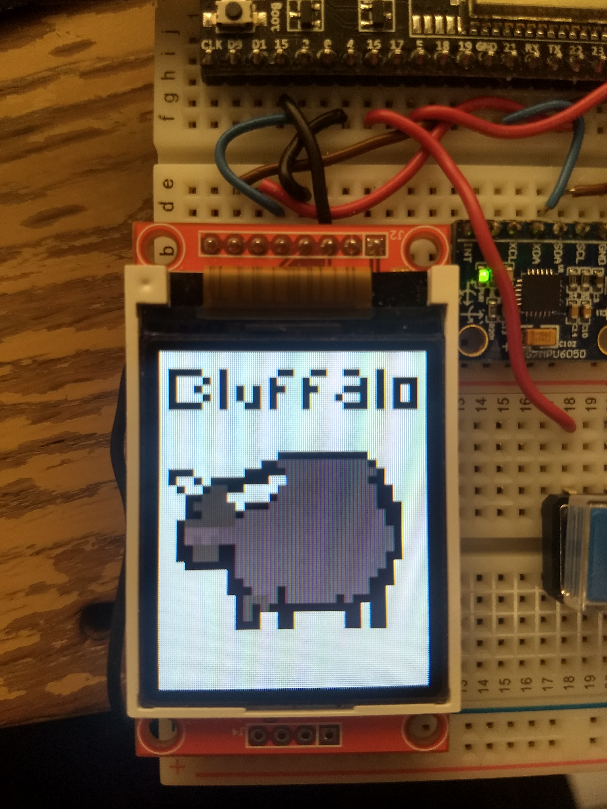

This was done in the file art.ino. The start screen was a simple use of the arduino TFT library of colors. The idea was to create pixel art, and given the screen’s resolution of 128x160, I broke the screen down into a 32x40 pixel grid. From there I used [pixilart.com](http://pixilart.com/) with a canvas of the same size in order to draw both the title and the buffalo art. The next step was to create a function that treated and drew 4x4 pixels on the LCD screen, which was a simple use of the drawPixel command from the TFT library, in conjunction with a for loop. From here I meticulously and tediously mapped the x,y values of each pixel and drew them with arduino code.

**Score Screen**

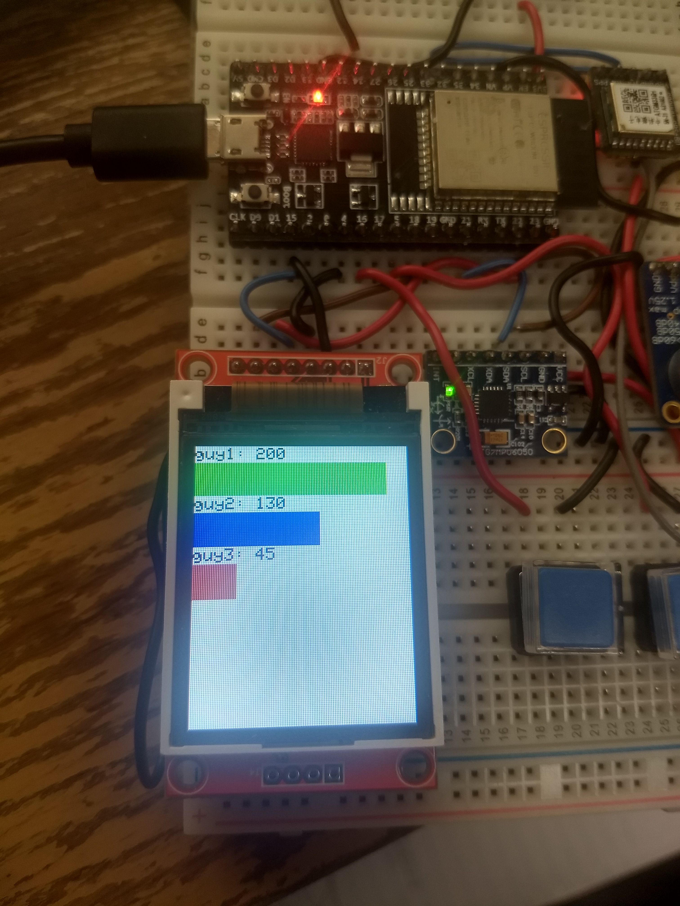

The score screen takes the form of a single support function, the specs are as follows. The function takes in 3 parameters, the number of players, an int array of scores, and a 2d char array of user names, upper bound by a user name of 20 char long. The only complex portion of this function was the score scaling, in which the bars must be scaled to the length of the highest score. I defaulted for 100 to be the default scaling if there was no score greater than or equal to 100, meaning that scores of 50 would still appear small on the screen, while any score over 100 would be the max length a bar can be, if it is the highest score in the game. Thus, at the start of the function I find the max of the array and if it is greater than 100, then the value is stored and the other scores are scaled to it. With 115 pixels as the largest possible bar, we do score/highest * 115 to get the length of each bar. A color array is stored in order to make each bar a different color. User name, score and bar and displayed in sections of 30 y pixels, with the first 10 pixels being text, and the next 20 being the width of the bar, repeated for the entire score for as many players there are.

### File Descriptions

- **art.ino**
    - This file allowed us to draw the buffalo that is displayed on the ESP at the start of the game.
- **button.h**
    - This was adapted from the classy button class we learned earlier in the semester. This is able to determine whether there has been a short press or a long press.
- **joebox-esp.ino**
    - This file is the majority of the ESP Functionality. It follows the State Machine flow that is described in the block diagram above. This code goes through the 13 states **(START, MAIN, LOBBY_HOST, JOIN, LOBBYGUEST, STARTGAME, CREATE, INPUTUSER, VOTE, SCORE, WAITINGSUBMISSION, WAITINGVOTES, OLDUSER, RESTART)** and the transitions between them
- **support_function.ino**
    - This file contains a majority of the supporting functions used to perform the GET and POST requests required for communicating to the server.

### Justification

The main idea behind the states and the set up of the state machine is that we would create a state for each and every screen, set up via state transitions. As a result we have the current set up. The only exception is the differences between the **LOBBY_HOST** and **LOBBY_GUEST.** While both screens are identical, the difference is how the lobby host has the ability to start the game, while the one in a guest lobby is only observing for when the game switches out of lobby state.

## Webpage

### Logic Flow

The servers logical flow is shown in the diagram below. The webpage checks the old state versus the new state of the server and generally mirrors the server state. There is one exception. In between voting and bluffing, there is a score state that lasts a specific amount of time. Basically, every second the loop function asks:

**Is the server in the Lobby?**

Show the lobby and its functionality

I**s the server Voting?**

Show the voting page and its functionality

**Was the server Voting before and Bluffing now?**

Show the score page and its functionality

**Have we been in the Score page for this amount of time?**

Go to Bluffing state.

### State Diagram

-1.jpg)

### How Does the Webpage Look as the User Plays the Game?

Our website is [tiny.cc/joebox](http://tiny.cc/joebox). All players go to that website to play the game. This website is paired with the server and each player's ESP. The design of the website is modeled after the Jackbox party games design.

**Room Code**

The first thing the player sees when they enter the URL is the option to enter a Room Code. The player gets the Room Code from the host of the room they want to join. To join a room, they enter that room code on their ESP as well as on the website. The first picture is the empty webpage, and the second picture is with the room code typed in. After that, the player hits the button submit.

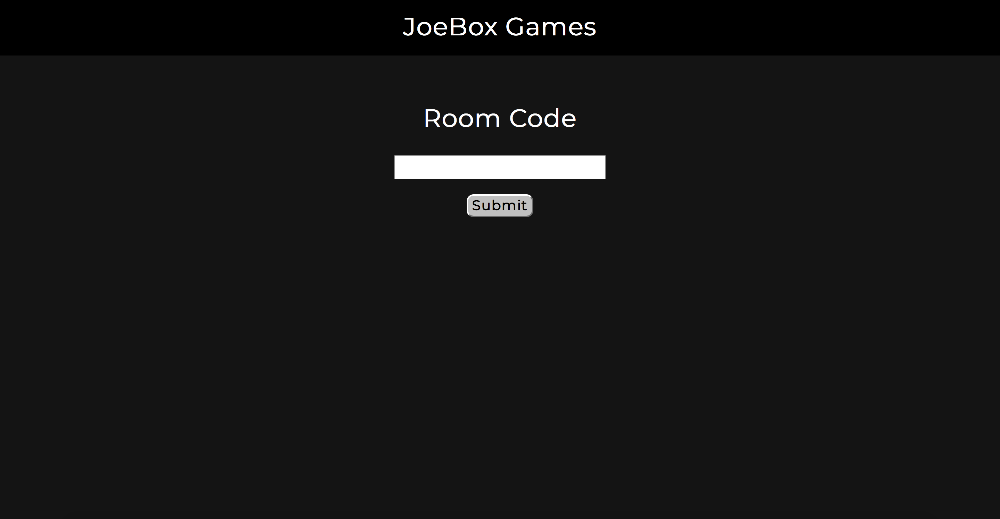

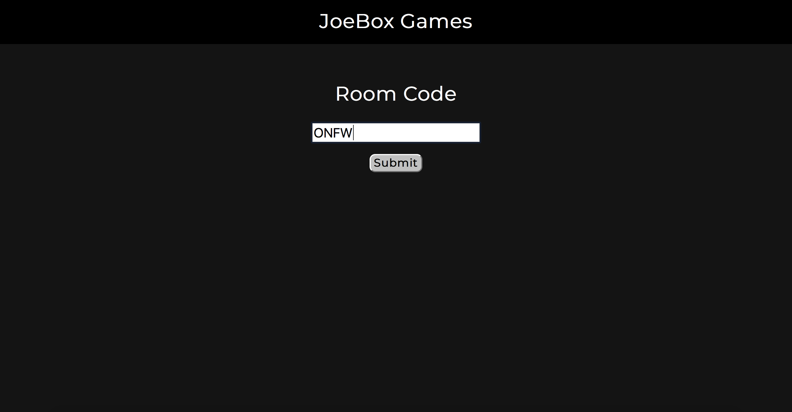

**Lobby**

When the player joins the room, they are placed in a lobby. In the first picture, there are no players in the game. In the second picture, 1 player has joined. In the third picture, 3 players have joined. The players show up when they are added to the room on the server. After all the players are in the game, they are waiting for the lobby host to press the button on the ESP to start the game.

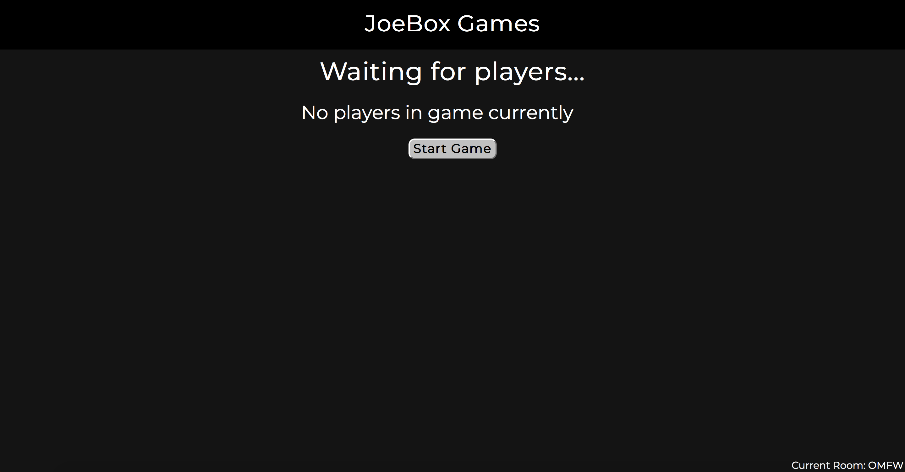

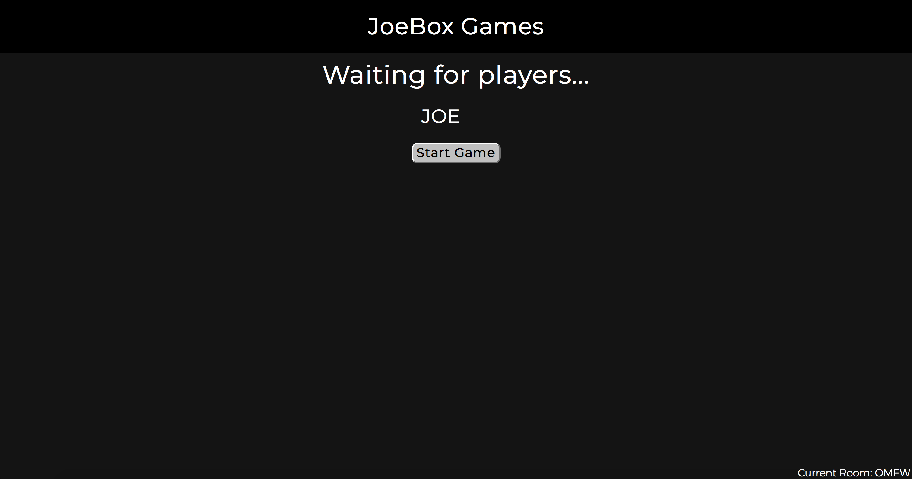

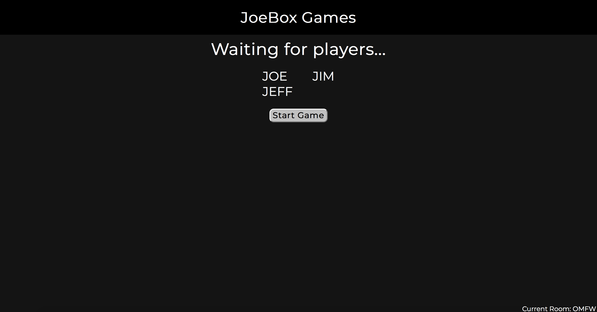

**Guessing**

Once the game is started, the players are given a word, the definition with the blank for what they are guessing, and the users in the game. In this case, the definition is one word so the only thing the players see is the blank. In the first screen, no one has submitted a bluff. In the second screen, two people have submitted a bluff. When a player submits a bluff, their name tag turns green.

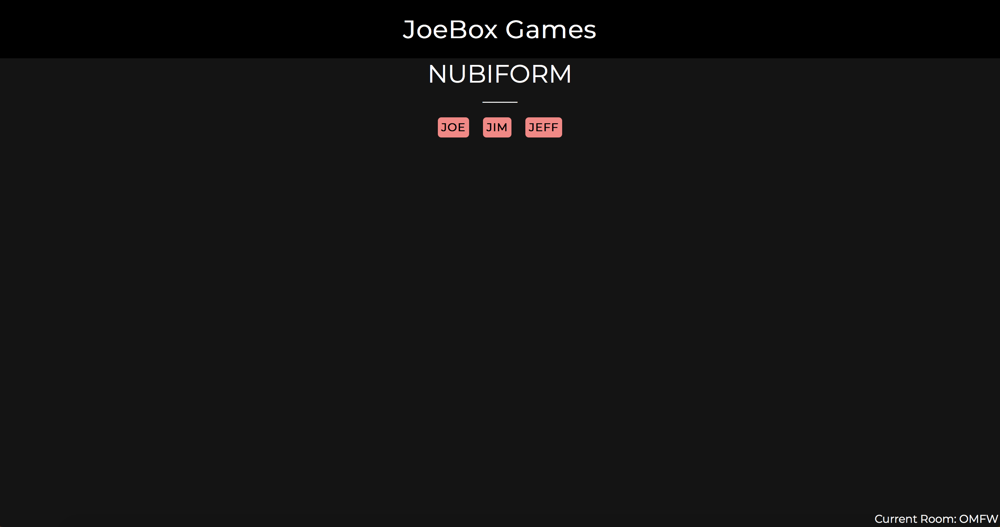

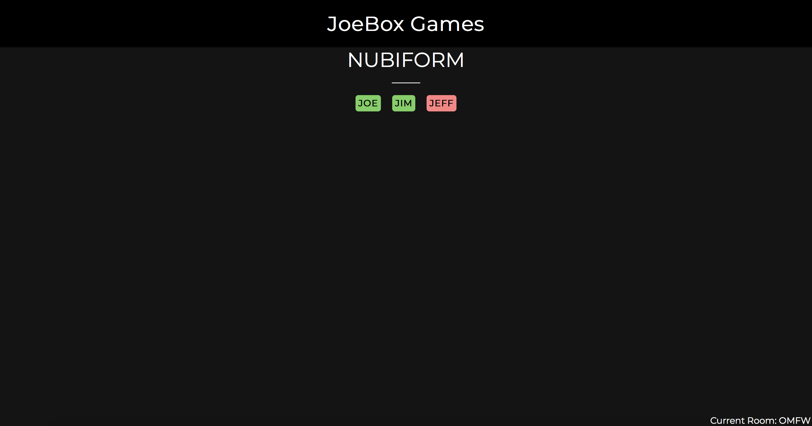

**Voting**

After the server transfers to the voting state, the webpage transfers to the voting screen. All the options are shown that can be voted on. As explained above, players are not given their own bluff on their ESP to vote for, so they only see, in this case, three options. The first screen is when no players have voted, and the second screen is when the two players JIM and JEFF have voted.

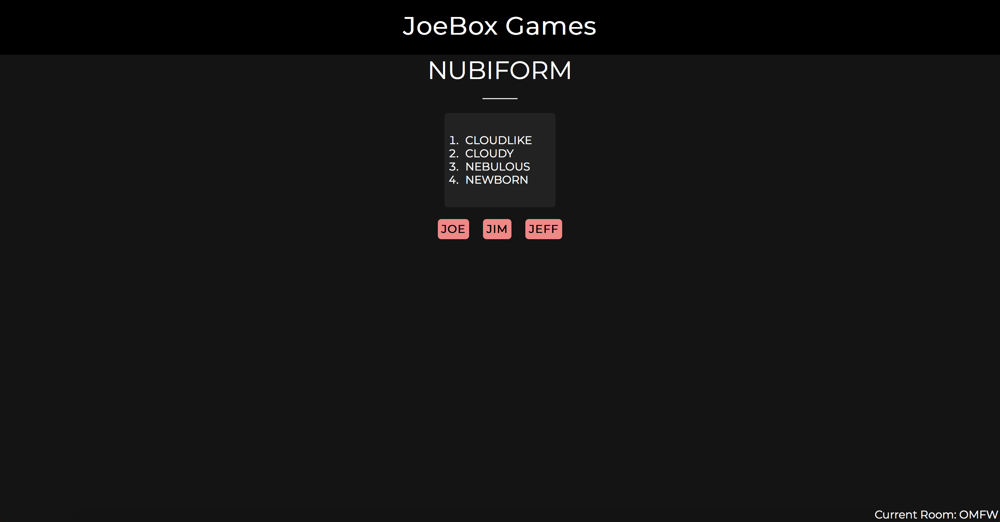

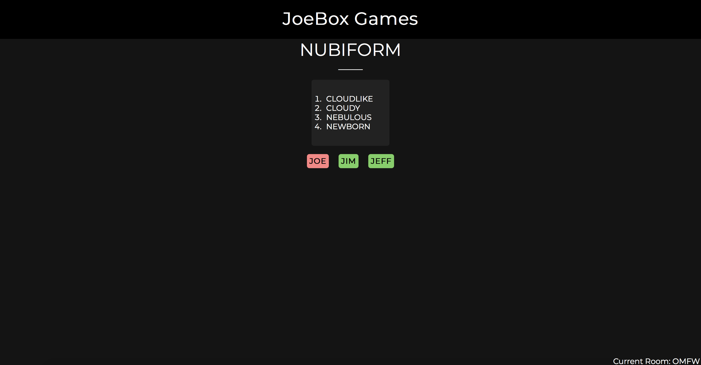

**Scoring**

When the server goes to the voting state, the webpage displays the players, ranked from first to last, and their scores.

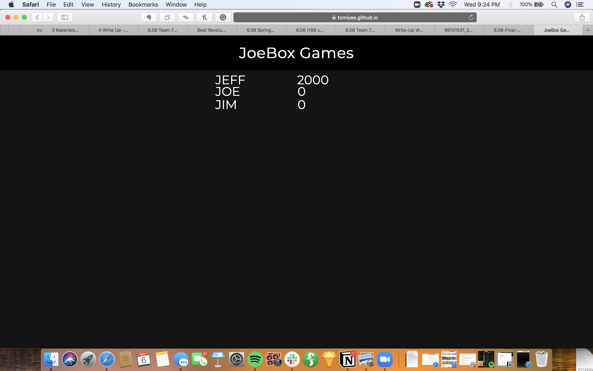

### File Description

- **init.html**
    - This file has four containers (input-container, lobby-container, game-container, and score-container). These are the four "states" of the webpage environment, as shown in the diagrams below. The **init.html file** served to explain what happened in each state (what the webpage would look like).

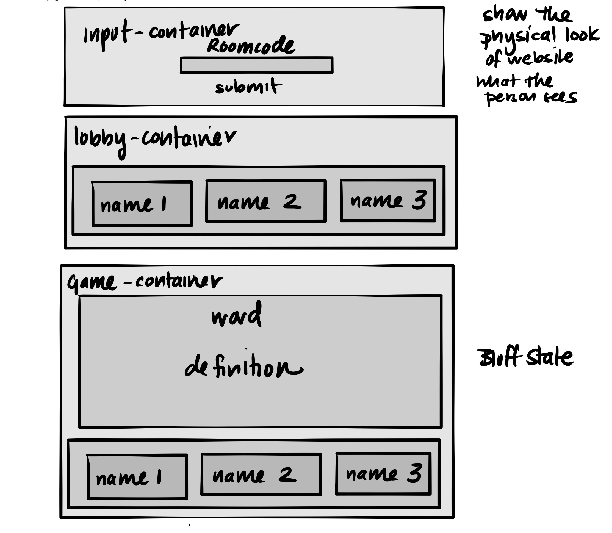

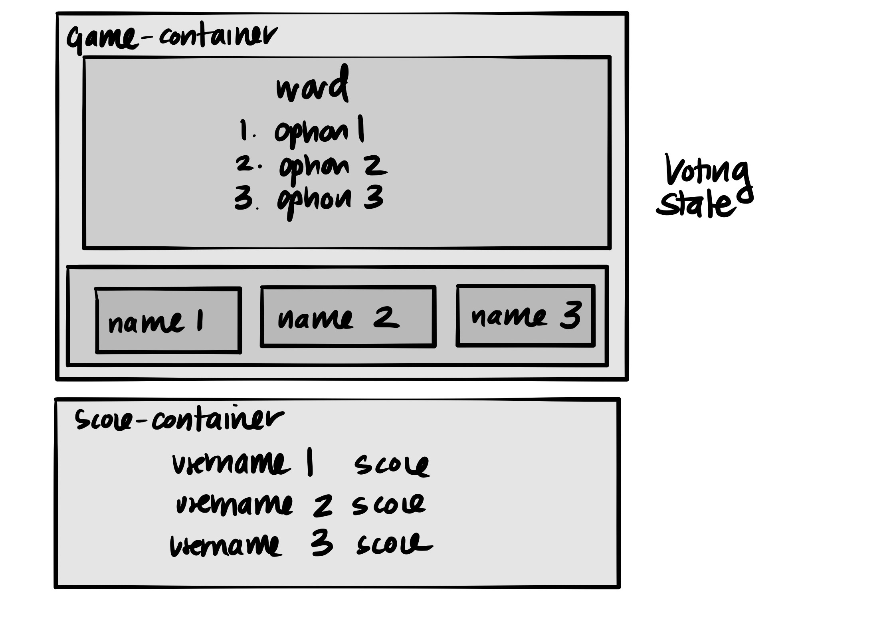

- **main.css**
    - This file handled all the stylistic elements of the website, such as background color, text color, width/height of each element, the transition speed between pages, etc.
- **main.js**
    - **function start -** this function styled everything on the page as the player started on the website. Part of its functionality was styling the page, hiding certain boxes, event handlers, and telling the webpage what a key press does.
    - **function loop -** this function dealt with the bulk of the webpages behavior. Firstly, if there was no roomcode inputted, the webpage would do nothing but wait for the roomcode to be entered. Second, once the roomcode was entered, it would send a request to the server for the game data and store that data. Additionally, this state monitored the waiting_for_votes variable on the server, and when it became (WHAT HAPPENS HERE). If it was in the the lobby, it would update the list of players. If it was waiting for submissions, it would update the list of waiting.
    - function **sendHttpRequest** - this function served as a template for HTTP requests where the parameters allowed it to send POST/GET Requests as well as specify the body and URL.
    - The other functions in the file included the functionality to enter the room code, display the lobby, display the options to vote on, display the players, and animate the submitted bluffs.

# Design Challenges

- **Server Modularization**: To avoid Git merge conflicts and to modularize our server functionalities, we call different functions in our server request handler, where the functions are separate files in the same folder as server.py imported into server.py
- **Unexpected Whitespaces**: It took an inordinately long time for us to discover that pesky unexpected whitespaces appeared in the responses from our server, and we needed to trim the responses before checking/processing them.
- **Character Arrays:** Character arrays became an unwieldy data type to work with order to display strings. We would constantly get problems with data types being overwritten, not overwritten when they needed to be, or other errors along those lines. Also, printing lists via the use of char arrays became a tedious task and one that required a lot of debugging.
- **Disconnection:** One of the design challenges we encountered was what would happen if a player was signed out while they were playing the game. In order to allow the player to reenter the game, we stored a token and the username the player had while in the game. When a player attempts to rejoin a room, the ESP is able to locate the data on its EEPROM, and allows the player to proceed with the same username.
- **Extracting Information from Database:** Another challenge was extracting infromation on the current player and game state from the online SQL Database. We originally thought about creating a lot of columns and possibly two tables on the online database, one to store current player information like their scores, whether they've submitted, and what they submitted in the previous rounds and another table to store game data like whether currently in lobby or not and which round the current game room is currently in. However, we figured that this way of implementation would take too many columns on the online database so we decided to store all the game/player information in two sub-dictionaries under a huge json dictionary with the room code as key, one of which is called 'player_data' and the other 'game_data'. We just used json.load() and json.dumps() to update the online database instead of the traditional SQL methods for updating database by identifying each of the columns. Instead our database only has two columns, one which is the room code and the other the json dictionary storing all the current game/player data information for the server to parse and extract relevant pieces of information out of depending on the function implemented.

# Weekly Milestones

## Preprocessing

1. **Obscure - Word Web-Scraping**

    Obscure words were found from the site Phrontistery, which contains a dictionary of 17,000 unusual English words. It contained a separate dictionary for words starting with each of the letters of the alphabet. We used beautifulsoup to scrape each of the 26 dictionary website links for its table containing a word and its associated definition, then saved each of these dictionaries in a separate file. Finally, we concatenated all the files together using a unix cat command to form the uncleaned database (a text file), filled with each of the 17,000 words and definitions, separated by a ‘=’.

2. **Dictionary Database with Definitions and Hidden words**

    After we obtained the uncleaned database of words, we cleaned the words by processing common phrases, then filtering out words with definitions that were too long, or contained irregular phrases causing recognition difficulty for the Rake-NLTK library. Finally, we used Rake to extract keywords from each of the definitions, after carefully manually replacing some suboptimal keywords. Finally, we saved first to a text file, then inserted the words, definitions without the answer, and the answer into a database.

## Server

1. **SQL Active Game Database**

    Created Python file for game database to send up room code, inputted word, and current player score for each player in the game. Database has four columns, one for room code, inputted word, player name, and their current score. Can be accessed via get and post requests through esp or postman.

2. **GET request for ranking players by score at the end of every round**

    Under the file called get_scores.py in the joebox_server folder, the get method get_scores takes in a four digit room code under the values in the get request and processes it to return a string of each player username followed by their current score all separated by commas ranked from highest to lowest score to help the ESP parse the string.

    This so that at the end of every round the website and esp can display the player rankings by their scores from highest to lowest score so far in the current game. Just like most of the other server files, it first checks if the room code is specified in the values of the GET request. If it’s not given, then we return that the code is missing. Then we connect to the online bluffalo database and get the row of data from our dictionary for the given room code then disconnect from the database since we’re done retrieving the data.

    Then, we check how many rooms there are with the given room code. If there’s 0, then we return that there’s no such room with the given room code. If there’s more than 1, we return an error message since we’re not supposed to have more than one room with the same room code. Then, we load the json dictionary with the corresponding room code and first retrieve a list of player usernames and their scores and then sort those tuples by the second element (score) in reverse order so we have a list of tuples of players with scores from highest to lowest. FInally, we append those values one by one into a new list consisting of strings of usernames and scores and use the ‘,’.join(list) function to return a string consisting of usernames and their scores separated by commas.

    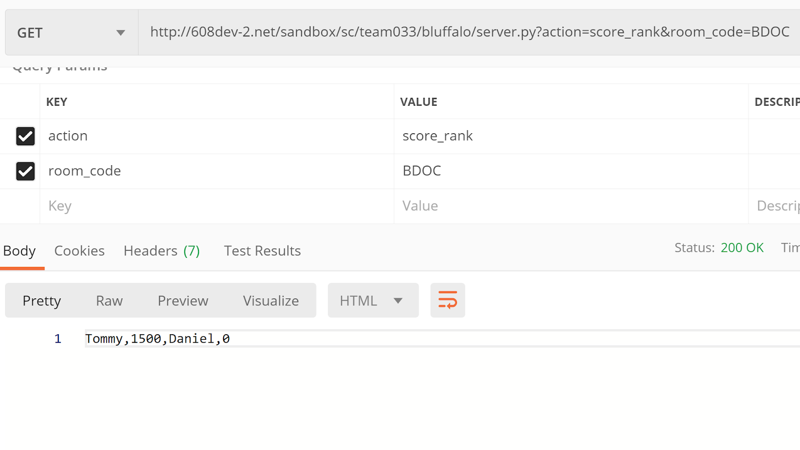

3. **GET Requests for list of scores**

    Given the four digit capital lettered room_code, this Get request should return a list of players along with their scores separated by commas. If the room_code doesn’t exist in our JSON string dictionary, we return that the room_code was not found. If more than one room exists in our database with the same room code, then we also return an error message for the ESP to register. Once we’ve found the room, we want to retrieve all game data from that room, including the player and game data from the dictionary using the json.load function.

    Once we loaded the room data for the given room code with the json.loads function once we used the SQL3 lite function to select the game data row with the given room code, I created a list of player usernames along with their current scores by using the append function in python.

    I used a for loop to loop through all the players in our room data dictionary under player_data, which is itself a sub dictionary of player names along with all their player states, including “scores”, which stores their current score in that game room for the current round. We first append the player name, and their score, which has to be converted to a str by appending str(room_data[‘player_data’] [player[‘score’]).

    [https://lh4.googleusercontent.com/x3nuFtDjp9KmYe0TsSz5ZLsV0qcznOCY1lULibIGchWoYFt8BclH2Q-XN3AW7gwcVDg4invjw0LlXrBdaBQopqNShdzZHJTVmL56nFISqZxT_FxXUdk_WdJtGYoU-As95rqJh8We](https://lh4.googleusercontent.com/x3nuFtDjp9KmYe0TsSz5ZLsV0qcznOCY1lULibIGchWoYFt8BclH2Q-XN3AW7gwcVDg4invjw0LlXrBdaBQopqNShdzZHJTVmL56nFISqZxT_FxXUdk_WdJtGYoU-As95rqJh8We)

    Finally, in order for the ESP to parse the data easier, I used the ‘,’.join(data) .join() function which joins all the strings in the list of strings in data and puts commas in between each string to help distinguish where one string ends and another starts, this is so that the ESP can parse each of the tokens

    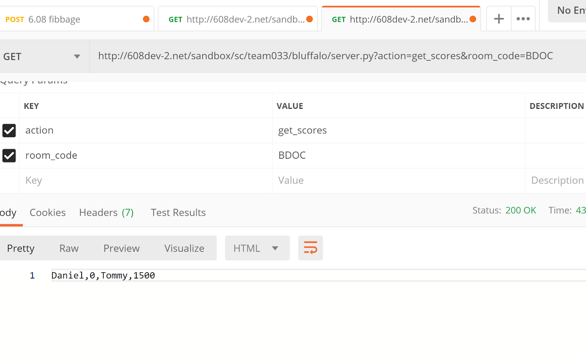

4. **Tell player to submit another bluff if they happen to submit the correct answer as a bluff**

    In the submit bluff server file for POST requests that take in a room code, username, and their bluff for the correct round, we want to check if they submitted the right answer. If they do, the server should tell it to submit a different bluff since that is not allowed. The actual process of checking this is quite simple. All we have to do is get the round and question number from the game data in the json dictionary for the specified room code if it exists and compute the word number from those two numbers using the formula

    Word_number = (round_number - 1)*3 + question_number - 1

    This word number represents the index of our current prompt under the “all_prompts” list in the game data dictionary that we loaded using json.load(). In order to get the correct answer for the current prompt from the list consisting of [‘current_word’, ‘current_meaning’, ‘current_ans’] under game_data[‘all_prompts’], all we need to do is index into that list of lists by using word number, where game_data[‘all_prompts’][word_number][2],which should return the correct answer to the current prompt.

    Then we just compare the bluff just submitted by the player, change it to lowercase (since otherwise it would be in capital letters) in order to compare it to the correct answer, which is in lowercase. If these two strings are equal to each other, we want to tell the player to submit a different bluff and not modify any of the other player stats for that player, like player[“submitted”] and player[“submission”] that would otherwise be modified if the submission was successful.

    As one can see, the before and after player stat for the player just submitted (Karen), stays the same after attempting to submit the right answer, which is “drop” for the current prompt/round.

    [https://lh6.googleusercontent.com/n7pJCMUKCkGlv9zYEkTpMOOtmHWPm2L-EtRcMDE8s9rLd9f7pzJC9-TWWQhFybnAKmqSlnFcuVXhj6JiFYrV8_gVz5E5O8qxGi-iqlL0cZnHxB03hLU9HVYg57WaM_hYqHThaTaC](https://lh6.googleusercontent.com/n7pJCMUKCkGlv9zYEkTpMOOtmHWPm2L-EtRcMDE8s9rLd9f7pzJC9-TWWQhFybnAKmqSlnFcuVXhj6JiFYrV8_gVz5E5O8qxGi-iqlL0cZnHxB03hLU9HVYg57WaM_hYqHThaTaC)

    [https://lh6.googleusercontent.com/8MT9d8pYX7AhfamaYjBrBpnyATu0dzife_O4xE8_l2OI2kO4KGk_hLoardPCt53EaHP1zU-2dKVOYl2-18_7accZJIb75Uj744lWhl61grKELMXAjyEue-IMsItNr6sZs8JrK_wH](https://lh6.googleusercontent.com/8MT9d8pYX7AhfamaYjBrBpnyATu0dzife_O4xE8_l2OI2kO4KGk_hLoardPCt53EaHP1zU-2dKVOYl2-18_7accZJIb75Uj744lWhl61grKELMXAjyEue-IMsItNr6sZs8JrK_wH)

    [https://lh5.googleusercontent.com/J97GzOJHQIiSdfNiVfwVa_jXkkP0KWmtNsax_cwGrjyzKl89zOlEM5orT-MKI_srrrTEYCBVaTxHdKwVA0ZvIcrlFyUa-DovUCtcJRMFQ7HYCQkYdWFMPp5To_3HIUXDys5MNdpS](https://lh5.googleusercontent.com/J97GzOJHQIiSdfNiVfwVa_jXkkP0KWmtNsax_cwGrjyzKl89zOlEM5orT-MKI_srrrTEYCBVaTxHdKwVA0ZvIcrlFyUa-DovUCtcJRMFQ7HYCQkYdWFMPp5To_3HIUXDys5MNdpS)

    [https://lh5.googleusercontent.com/luqGMD9YAZv9F3tU_V-rv7jXnT1HZWVNR3sONpyR2URA2v7FBdgR7luMsYeHrEACMtrvAWYhIGPGOXIm3PRm1He6Q0jE8ojh6NHLFJ_PuBEn8HlZqGjbz7C6jIID4jLKqtDivUw7](https://lh5.googleusercontent.com/luqGMD9YAZv9F3tU_V-rv7jXnT1HZWVNR3sONpyR2URA2v7FBdgR7luMsYeHrEACMtrvAWYhIGPGOXIm3PRm1He6Q0jE8ojh6NHLFJ_PuBEn8HlZqGjbz7C6jIID4jLKqtDivUw7)

5. **If disconnected, allow for a player to rejoin a room if they joined the game before it had started**

    In the server, we handle this by assigning every user a unique token. On the first successful connection, the server will return the string “Token: <token>” and the ESP will save the token to long-term memory. In the case of a disconnect, the user will attempt to reconnect to the game using the token.

    If the server considers the token provided to be valid, it will return a string to the ESP “true,<state>” or “false,<state>” where the state is either “lobby”, “vote”, or “bluff” for each of the possible game states. It will return true for the first parameter to indicate if the ESP needs to go to a state that allows for input (“true,vote” goes to a state for entering the user’s votes), and false if the the user does not need to enter input (i.e. if they’ve already submitted a vote). This way, the ESP can change to the appropriate state.

6. **Only allow usernames with capital letters to join the game**

    Basically, whenever the username comes into the server, the server loops through all of the letters in the username. If any of the characters are not in a string “ABCDEFGHIJKLMNOPQRSTUVQXYZ”, then the entire name is immediately rejected. This prevents the user from entering anything as an unexpected username through Postman. I’ve attached a screenshot of Postman demonstrating the inability to join the game.

    [https://lh4.googleusercontent.com/ajSN_FkRIvMhhxIQ7DSR-e-j-R1oenYS9Vpq_XCWge1xl8CsijnzMuaZyet5FIuBuCAjP9xREJtkdP_ed_oaRfE3X5KSKK-YOeK6xubWNzuMa6-VUe56-dV6JPjzKa-B7mAyY3vb](https://lh4.googleusercontent.com/ajSN_FkRIvMhhxIQ7DSR-e-j-R1oenYS9Vpq_XCWge1xl8CsijnzMuaZyet5FIuBuCAjP9xREJtkdP_ed_oaRfE3X5KSKK-YOeK6xubWNzuMa6-VUe56-dV6JPjzKa-B7mAyY3vb)

7. **API- GET (game_check.py) room_code and in_lobby**

    For the sake of demonstration, the server’s **game_data.db** is initialized with one room. The room code is **“ABCD”** and the **game_data** for this room is the following json:

    With this data, a GET request that checks if the room code “ABCD” exists should return “true”, and should return “false” for any other room code. I did this by fetching all the rows in the SQL database with the matching room code. Then, if the number of rows is 0, I return “false.” Here’s a screenshot showing that it works using the generic http request function I implemented last week.

    [https://lh6.googleusercontent.com/bNAkHpwhj50LoEyKN0Akzdqv64rHqtA35QhdaW7FM6-2Ecejw7BHqQt9l1R7b2TBA3ai7IbGdROmC-uX1qUxANKnZth0lrw0VwiOxaEFDAQZ5q2slHV880iuaSgzGoWvwUCTN9Sn](https://lh6.googleusercontent.com/bNAkHpwhj50LoEyKN0Akzdqv64rHqtA35QhdaW7FM6-2Ecejw7BHqQt9l1R7b2TBA3ai7IbGdROmC-uX1qUxANKnZth0lrw0VwiOxaEFDAQZ5q2slHV880iuaSgzGoWvwUCTN9Sn)

    As you can see, I sent a GET request with the action “room_code_check” and two different room codes. The first room code is ABCD, which is the demo room code and correctly returns the string “true.” The second room code is AAAA which is not a valid room code and correctly returns the string “false.”

    Next, the in_lobby GET request should return false, since in the above example game_data, the [‘in_lobby’] component of the dictionary is false. It correctly returns so:

    [https://lh6.googleusercontent.com/gMK2z-5an_mnLqjp8vKaIoTCPQfQEYY_JQtOhtWJ6lUMViTVXis-_3bRYDSIwcI8ir7nudRXdI0zW7gTmc6TbmB1txVgNF_jsMRFlW2iTfFb_MUPVgJCgkAfCFMKIhbtwNPs2zVD](https://lh6.googleusercontent.com/gMK2z-5an_mnLqjp8vKaIoTCPQfQEYY_JQtOhtWJ6lUMViTVXis-_3bRYDSIwcI8ir7nudRXdI0zW7gTmc6TbmB1txVgNF_jsMRFlW2iTfFb_MUPVgJCgkAfCFMKIhbtwNPs2zVD)

8. **API - GET (word_prompt.py) Current Prompt Handler**

    This returns the current word in the database corresponding to the submitted room code. We created a handler in word_prompt.py that is imported into [server.py](http://server.py/). The handler current_prompt will return the current prompt for the room corresponding with the provided room_code in the format “<word>=<definition with blank>.”, which it obtains from a GET request to the server. Here is an example of this using Postman and the sample room shown in Deliverable 1.

    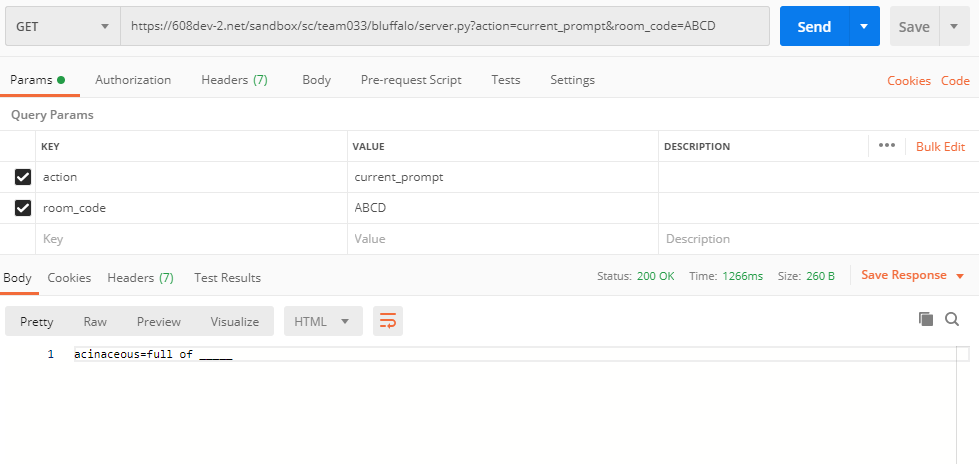

9. **API - POST (submit_bluff.py) Submit Bluff Handler**

    This function processes a post request that includes in the body their room code, a player’s username for the game, and the word they just submitted on their ESP in the current round. This function fetches all the player and game data in the online database table for the room code submitted and converts that json string into a python dictionary and set the ‘submitted’ and ‘submission’ variable for the current player with that username to true and their bluff submitted, respectively, to show that this player has submitted a word along with the word they just submitted.

    Then I look through all the players under player_data in the all player and room data dictionary from the table and check if all current players have submitted something and count the number of players who haven't submitted a word.

    If everyone has submitted, we set the waiting for submissions and selection options variables under game data to be false and true respectively. At the end we wanna return the number of players who have not submitted a word this round if we successfully added the player and their bluff to the table using a try and except statement and return ‘None’ otherwise.

    For the purposes of visualizing our updated database after submitting a player with username “Joe 1” with his bluff word as ‘joe’, I returned the entire room dictionary after updating it with the new submission instead of just the number of players who are left to submit. Here we can see that player “Joe 1” has ‘submitted’ set to True and submission equal to his new word, ‘joe’.

    [https://lh4.googleusercontent.com/fmbg7Daw6fE1CfSFdMs0KZqsk2EAzMVbM1nBAp2_y2qLMx38tUJJP5XWwb3eHlbJDWZwkFGEjibM08fLs3spm1rHfqivBSa7ZkiFBf-ETTLKxo9V3yzNwBwFJSsgvE4gJP8mLTIi](https://lh4.googleusercontent.com/fmbg7Daw6fE1CfSFdMs0KZqsk2EAzMVbM1nBAp2_y2qLMx38tUJJP5XWwb3eHlbJDWZwkFGEjibM08fLs3spm1rHfqivBSa7ZkiFBf-ETTLKxo9V3yzNwBwFJSsgvE4gJP8mLTIi)

10. **API - POST (join_room.py) Join Room Handler**

    Given a post request consisting of a room code in form of string and a player’s username also consisting of a string, we want to fetch the player and room data from the online table database for when the room code is the room code in our post request. First I loaded the json file into a python dictionary using the json.load function from the json import and set that room player data score for user to be 0 since the player just joined the roo so we need to initialize the player in our dictionary or json file on the online database table. We also wanna initialize ‘submitted’ for this user to be False and ‘submission’ None since the game hasn’t started yet so therefore everyone starts with these variable states at the beginning.

    Then, we update our SQL table with our new room dictionary after inserting the new player into our player data sub dictionary in the player and room data main dictionary. Finally we change this dictionary into a json file using the json.dump function and reinsert it into our online table by replacing the old json file for the current room code using the update and set functions where roomcode = room_code from the POST request.

    Finally, we want to return a list of all players currently in the game by looping through the players in room[‘player_data’] and adding them to a list. I formatted it so that the player user names are separated by a single comma without the quotation marks by using a for loop. Upon the POST request, we get to see a list of players currently in the lobby by looping through all the players in the table currently including the player that just joined the room (which triggered the post request for the join room function).

    players = [player for player in room['player_data']] #code to retrieve all players currently in lobby

    Here is an example of it working on the website. Here, a demo room with room_code IPVQ is “in_lobby,” so when a user wants to join the server, it will update appropriately.

    [https://lh3.googleusercontent.com/fHtZwZwgn_0CWdGx6YXbMvfSgWjCap5e10QCnAlmrzPVF6gs-S5N8hHRBedSMZSZ3gtr7X0VVmxMD5ti7oVX-W230_MYcsUQj2AdS4sX0Ip4RemFiUf6YF0tgKSvmJAMy9H4Ljb1](https://lh3.googleusercontent.com/fHtZwZwgn_0CWdGx6YXbMvfSgWjCap5e10QCnAlmrzPVF6gs-S5N8hHRBedSMZSZ3gtr7X0VVmxMD5ti7oVX-W230_MYcsUQj2AdS4sX0Ip4RemFiUf6YF0tgKSvmJAMy9H4Ljb1)

11. **API - POST (start_game.py) Set in_lobby to false**

    The goal of this deliverable is to set the in_lobby to false when the POST request is sent to the server. This way, once the game has started, no new players can join the game.

    Here is an example of the server with a room that starts out in the lobby. After calling the start_game action, the game is no longer in the lobby and no new players can join. Once the start game is called, it will return a comma separated list of the players currently in the game.

    [https://lh5.googleusercontent.com/hAtRmJHguiZ2RYxx3NFEK36644J2MdPPRRmWyBu8n62joZXeZBUij2Qk65422FXNv81Xzyk23CHdlMxoEsN0EnL34EGojdhOXi0OSq5qLqP14q2lFWVi82HXlwDRJRWXGBB4iO3w](https://lh5.googleusercontent.com/hAtRmJHguiZ2RYxx3NFEK36644J2MdPPRRmWyBu8n62joZXeZBUij2Qk65422FXNv81Xzyk23CHdlMxoEsN0EnL34EGojdhOXi0OSq5qLqP14q2lFWVi82HXlwDRJRWXGBB4iO3w)

12. **GET request that returns list of submissions**

    [https://lh5.googleusercontent.com/eEGeX4Eth7t13q2kxj_BV6Pd11F3r5u-pk3FLYj3su_HB1eubJDkhbJUsQzzOWayNCx9xJwljP3wfulYO9YOulJtq7Jy_09Tm1_Y1ItfT9G4mueMMXAxtR-1kcwZ8uMPt4J41x1f](https://lh5.googleusercontent.com/eEGeX4Eth7t13q2kxj_BV6Pd11F3r5u-pk3FLYj3su_HB1eubJDkhbJUsQzzOWayNCx9xJwljP3wfulYO9YOulJtq7Jy_09Tm1_Y1ItfT9G4mueMMXAxtR-1kcwZ8uMPt4J41x1f)

    Send a GET request to the server with the room_code and the server should respond with a comma-separated string of submissions, in a consistent, random order.

    Given the room code and a player’s username, this get request should return a list of submissions, including the right answer and excluding the bluff the current player submitted since players can’t vote for their own answers.

13. **POST Request for Votes and Tallies Scores**

    This POST request requires the room_code, the user, and the 0-indexed choice that this specific user chose. Because the way we generate the list of bluffs for each user is deterministic, the server does this process to get the list and selects the bluff at the provided choice_index. It then checks who created this bluff and appends the user to the creator’s list of fools. We also set the user’s “voted” property to True. Once all player’s voted properties are set to True, then we update all the player’s scores. The voted values are only ever set to False if we are not currently waiting for votes. For example, they should all be True while we are waiting for submissions, and then set to false once all submissions are done.

    Here is an image of the scores of the players before and after they finish voting.

    [https://lh4.googleusercontent.com/TfgTkDJsMtamPue19C-cuyUA5d7Pq8dcJkuC2vVeko6Zh17wBZka3wmvWvt5Szeiy6Ti6OFvojp_JfrB76FZuYnh5jAJwvHoaaf8NuLoUY3iBzvoFJ8hdIMrPXAuBSMv78zQT0so](https://lh4.googleusercontent.com/TfgTkDJsMtamPue19C-cuyUA5d7Pq8dcJkuC2vVeko6Zh17wBZka3wmvWvt5Szeiy6Ti6OFvojp_JfrB76FZuYnh5jAJwvHoaaf8NuLoUY3iBzvoFJ8hdIMrPXAuBSMv78zQT0so)

    [https://lh5.googleusercontent.com/XDGHWT88lNkQ04tl6kj5h-iFl0-lC9a9hWuEngvAliAMqCSksoILw3SG_b-seEMB-2fKSyeIgVKX6o7FHHmUf9ZuiFMNASm_N9fa5bwjoHyy2Tr__jl6Sjjk5Wm_-lvav3RMeEgL](https://lh5.googleusercontent.com/XDGHWT88lNkQ04tl6kj5h-iFl0-lC9a9hWuEngvAliAMqCSksoILw3SG_b-seEMB-2fKSyeIgVKX6o7FHHmUf9ZuiFMNASm_N9fa5bwjoHyy2Tr__jl6Sjjk5Wm_-lvav3RMeEgL)

    Tommy voted for the correct answer, so he got +1000 points. Daniel then voted for Tommy, and so Tommy got +500 points. Thus the round ended with Tommy gaining 1500 points.

14. **POST request creates a room and returns code**

    This POST request handles generating an empty room dictionary. The default properties of the room are as follows:

    This is fairly intuitive, since when the game starts, no players are in the game yet and we are not waiting for anyone to finish voting.

    Additionally, once we’ve created the new room, we generate a random string of four capital letters. If this random string of four capital letters happens to already be taken, then we enter a while loop which will repeatedly generate strings of four letter words until we hit one which is not already taken. Once we generate a four-letter string which is not already taken, we add it as a row to the SQL database of players and then returns the four letter string in the POST’s response.

15. **GET List of Current Players in a Room**

    Goal: Send a GET request to the server with the room_code and the server should respond with a comma-separated string of players' names.

    This function is a get request that gets a list of players currently in the game with room code equal to the ‘room_code’ parameter sent up as one of the values in the GET request. In order to get a list of player usernames currently in the game with the room code, we must send a query with action equal to list_players to represent the kind of information we’re trying to get from the server. In order to get a list of players who’s currently in the game, we need to loop through the players in the player_data dictionary inside the room JSON dictionary once we fetch it off the server. This list should not have any repeats in players since the players are stored in a dictionary and python dictionaries don’t repeat.

    [https://lh5.googleusercontent.com/q2Flyclt8dE8e6LR-RnUNYI97Rss4ozerU8sEXesdqLihSEjqW5DfodZTXOudfURDLabCKHdV344QSwCtm-813WrRv7HU8C2Q_F7Kom0WRCKOo1DS21Qbjo6kD0gWCX9UmUSFyh1](https://lh5.googleusercontent.com/q2Flyclt8dE8e6LR-RnUNYI97Rss4ozerU8sEXesdqLihSEjqW5DfodZTXOudfURDLabCKHdV344QSwCtm-813WrRv7HU8C2Q_F7Kom0WRCKOo1DS21Qbjo6kD0gWCX9UmUSFyh1)

16. **Select Random Prompts when Starting the Game**

    Whenever a room of players finally starts the game using the start_game action, the server will select exactly seven prompts from the database. It will also initialize the round number and question number to both be one. This way, we can determine the index of the question which we are on and return the appropriate prompt as the current prompt.

    Here, we create a room with the room code BDOC. I created a helper API call which will return the JSON object representing the Room Data, and this is what I get as the data for this room after adding two players: Tommy and Daniel.

    [https://lh4.googleusercontent.com/wsMR-kJ4kWtFx0_CZ4A5q63dMczcrOQyfjydktfksnUxnKsnWue9si9S450kRi6dEfvyU01aQHCx7OryMJQh47n7E05gxdO_tqbpL5MJ-AOBAtYKVB8VXOdB8F_kDpwOdehyG8cr](https://lh4.googleusercontent.com/wsMR-kJ4kWtFx0_CZ4A5q63dMczcrOQyfjydktfksnUxnKsnWue9si9S450kRi6dEfvyU01aQHCx7OryMJQh47n7E05gxdO_tqbpL5MJ-AOBAtYKVB8VXOdB8F_kDpwOdehyG8cr)

    Notice that all_prompts in game_data is still an empty list. Once we trigger the start_game action and call the dump, we find that the all_prompts is fully populated with a randomized set of prompts.

    [https://lh5.googleusercontent.com/0pJFyciu6ItbqvTJF5SjQQDPWHKCCtgej4cMzLsKskL5nUhECeYlRQvdxr2nUX9619lB_XypiAmg1vzFGRgVbyaRScXkbpLqmk2xXKFmH897Phe8-b96H5YQKBt8i82H9XgOLhee](https://lh5.googleusercontent.com/0pJFyciu6ItbqvTJF5SjQQDPWHKCCtgej4cMzLsKskL5nUhECeYlRQvdxr2nUX9619lB_XypiAmg1vzFGRgVbyaRScXkbpLqmk2xXKFmH897Phe8-b96H5YQKBt8i82H9XgOLhee)

## Website

1. **Design of Front-End Webpage**

    Using HTML, Javascript, and CSS files, we created a simple, static web page hosted on Github Pages, accessible at [http://tiny.cc/Joebox](http://tiny.cc/Joebox). It has a header that is flush to the top and sides of the page.

    We added an input to the HTML file and a div to indicate that the input is meant for room codes. Once the user types the room code and hits enter, the input and its label are hidden. The next screen will show the current room that the user is a part of.

    In the future, we plan on rendering anything relevant to the current game state, like options to choose from or prompts for people to enter responses on their ESP32.

    Additionally, instead of blindly entering a room given any string for the room code, the webpage will first send an HTTP request to check if the room actually exists prior to hiding the input. If the room does not exist yet, the user will instead be prompted to confirm that they want to create a new room with the room code.

2. **General HTTP Request Method in Javascript**

In order to make an abstracted version of an HTTP Request method, we began with looking up built in methods in Javascript for making and handling HTTP requests. The built-in HTTP request methods were asynchronous, so we wrap each request in a Javascript Promise before returning it. The benefit of a Javascript Promise is the ability to add an event listener for when the response finally comes back, allowing for non-blocking HTTP requests.

However, for simplicity, we will treat these Promises as synchronous requests by prefixing calls to the generic HTTP request method with the await keyword. In the future, we plan on optimizing the code to take advantage of the non-blocking nature of Javascript Promises.

3**. Have a list of people who have submitted bluffs each round**

On the website, there are boxes with the names of all the players (above, the player usernames are A, B, C, and D) that are currently in the room. These boxes start with a light red background color, indicating that these players have not voted/bluffed yet. Once the user votes/bluffs on their ESP (A is the only player above who has submitted a bluff so far), the server will detect this change in player status, and change their player’s background color to green. It then changes back to 0 when the server transitions to the next state.

[https://lh4.googleusercontent.com/NjTAvEm9QSrT_NuGSQdIwrRyOXVtx9qs0_gHFib2kSBAw6tABl_cAKIyNatHT8nrXdbUdTgFArFRRDXqwuxaKOb5vOXiE5fPPz9KUdl1MmwTd09bQ6NOXkMKfnkwnr8AfC57h-We](https://lh4.googleusercontent.com/NjTAvEm9QSrT_NuGSQdIwrRyOXVtx9qs0_gHFib2kSBAw6tABl_cAKIyNatHT8nrXdbUdTgFArFRRDXqwuxaKOb5vOXiE5fPPz9KUdl1MmwTd09bQ6NOXkMKfnkwnr8AfC57h-We)

The first few seconds of this video demo will show that Karen and Izzy have already voted, and the only player that we still need to vote is Tom. The moment that Tom votes, we move on to the next state, since everyone has finished voting.

[https://www.youtube.com/watch?v=EE2HcDmkshY](https://www.youtube.com/watch?v=EE2HcDmkshY)

**4. Animate screen between rounds**

On the website, because Javascript can work with JSON objects much more easily than in C, we implemented a data_dump action, which returns the entire room_data object as a json string. The website is then calling this action once a second, requesting the full game state and parsing the game state into a dictionary. The website then detects changes in state by comparing the newly fetched game data with the game data from a second prior. If it finds that the previous state was “voting” and the new state is “submissions,” this triggers the animation that shows the results of voting.

The animation for voting is a table which shows the rankings and scores of all the players before we started voting, and the animation shows the rows of the table sliding into their new rankings. The video linked below is a demonstration of this animation in action.

[https://www.youtube.com/watch?v=EE2HcDmkshY](https://www.youtube.com/watch?v=EE2HcDmkshY)

**5. Display the Current Prompt if Not in Lobby**

Recall that the demo game_data is:

This demo video illustrates this functionality. Using the in_lobby and current_prompt actions implemented in deliverables 1 and 2, the website would first check if the room is in the lobby and waiting for people to join. If the game is not waiting in the lobby, then the website requests the current_prompt, displaying the word in large font above the definition with a blank. The following demo video shows this functionality, at the functionality for deliverable 10.

[https://youtu.be/-Mo591r9yVo](https://youtu.be/-Mo591r9yVo)

**6. Prevent Entering Invalid Room Code**

Using the room_code_check action that we implemented in deliverable 1, we would check the user’s submission for invalid room codes. If it is valid, then it will proceed with displaying the current word and prompt. Otherwise, an error message appears below the submission box. We also restrict room codes to be phrases consisting of only capital letters, and any letters that are entered into the text box automatically appear as upper-case, even if the user enters lower-case letters.

*Demo Video:*

[https://youtu.be/-Mo591r9yVo](https://youtu.be/-Mo591r9yVo)

**7. Display List of Players While in Lobby**

After implementing the API call which returns a list of all the players in the game, this part was as simple as making an API call to the server, receiving the comma-separated list of players, parsing it, and then listing them onto the website.

When we display the names onto the website, the names are displayed on a table with two columns. The borders of the table are hidden, so the only thing that the user can see is the list of names.

While the website is in this state, the website will continually send GET requests to the server checking if the room is still in the lobby and getting the list of players, keeping it up to date in close to real time. If the server responds that the room is no longer in the lobby, then the game has started, and we move on to continually displaying the current prompt instead of showing the list of players.

[https://lh3.googleusercontent.com/ve4GWPsxZ8Ngu9gBNiCySQ-vVt_tJr8vTjItsUjRsYBLalOXkl15peU9wNESdUkZR9ArjzBQvCXcCC8OsnlHDkscmdnuY9d8wLVGI3irbBG8GDAD3zATvb0tpZ-gd6QAUOUx66lE](https://lh3.googleusercontent.com/ve4GWPsxZ8Ngu9gBNiCySQ-vVt_tJr8vTjItsUjRsYBLalOXkl15peU9wNESdUkZR9ArjzBQvCXcCC8OsnlHDkscmdnuY9d8wLVGI3irbBG8GDAD3zATvb0tpZ-gd6QAUOUx66lE)

## ESP

1. **Hardware/Working Input Mechanic**

    For inputting words: use gyroscope and fancy button class (long vs short press) to for players to input letters for words and long press to submit their word, which sends a post request to the server.

    - Short press to confirm the letter typed just now
    - Long press to finish typing word and send it to the server for submission at the end of the round before timer stops
    - Tilt device right to move down the alphabet, from a to z
    - Tilt device right to move up the alphabet, from z to a
    - Letters also include a space character for if we want to input two words

2. **ESP State Machine**

    State start:

    - “LONG PRESS TO JOIN GAME”
        - If capacity exceeded: “SORRY CAPACITY EXCEEDED, JOIN NEXT GAME”
        - Else: Proceed to state 0

    State 0:

    - One player holds the “control” for the entire team for when to start a new round
        - “LONG PRESS TO START NEW ROUND”
        - If long press and not enough people: “NOT ENOUGH PEOPLE TO START GAME”
        - Else: Proceed to state 1
    - Other players:
        - “WAITING FOR PLAYER_NAME to start new round”

    State/page 1: (web: choose a category)

    - LCD Display (only for the player randomly selected to choose a category), the rest of the screens of players can’t select
    - Screen for chosen player:
        - “CHOOSE A CATEGORY”
        - “Food”
        - “Music”
        - “Movies”
        - “Pickles”
    - Short press to move down list (cursor displayed by highlighting feature for tft texts)
    - Long press to select option to send to server (when long press, switch to state 2)
    - Screen of the rest of players (unselected): “waiting for player_name to pick a category”

    State/page 2: (web: Display the sentence with the fill in the blank)

    - LCD Display: “INPUT WORD BELOW:”
    - Timer: 45 seconds for player to think and type
    - During this time each player must input using the button tilt mechanic to enter a word for the blank to fool the other players
    - Before timeout, all players should long press to send their input word to the server to be processed at the end of the round
    - If somehow hasn’t inputted any words at the end of the 45000 milliseconds timer, we still proceed to page 2
    - Switch to state 3 at the end of 45 seconds in state 2

    State/page 3: (Web display: The sentence with the blank and 5 choices (or less if someone didn’t submit a word before timeout in state 1)

    - “SELECT AN OPTION BELOW”
    - “Apple”
    - “Banana”
    - “Orange”
    - “Pear”
    - Short press to scroll down the options (wraps around at the end)
    - Long press to select word and send to server (sends up which choice player is selected to online database)
    - Switches to state 4 at the end of 45 seconds timeout

    State 4 (web display: which words got the most votes and by which player)

    - ESP display: “time to see who fooled who!”
    - Timeout: however long the web server takes to display all the words and who they were voted by (by the time all words and their votes have been displayed)
    - At the end of timeout: switch to state 5
    - Timeout: around 40 seconds

    State 5: (web display: current scores of each user so far)

    - Esp display: bar graph of each person’s score so far
    - Timeout: ~ 40 seconds (until the web server finish displayer each person’s score and who moved on top of whom in terms of score)
    - Switch to state 0 to start new round

3. **Start Screen**

    The start screen was a simple use of the arduino TFT library of colors. The idea was to create pixel art, and given the screen’s resolution of 128x160, I broke the screen down into a 32x40 pixel grid. From there I used [pixilart.com](http://pixilart.com/) with a canvas of the same size in order to draw both the title and the buffalo art. The next step was to create a function that treated and drew 4x4 pixels on the LCD screen, which was a simple use of the drawPixel command from the TFT library, in conjunction with a for loop. From here I meticulously and tediously mapped the x,y values of each pixel and drew them with arduino code.

    

4. **Score Screen**

    The score screen takes the form of a single support function, the specs are as follows. The function takes in 3 parameters, the number of players, an int array of scores, and a 2d char array of user names, upper bound by a user name of 20 char long. The only complex portion of this function was the score scaling, in which the bars must be scaled to the length of the highest score. I defaulted for 100 to be the default scaling if there was no score greater than or equal to 100, meaning that scores of 50 would still appear small on the screen, while any score over 100 would be the max length a bar can be, if it is the highest score in the game. Thus, at the start of the function I find the max of the array and if it is greater than 100, then the value is stored and the other scores are scaled to it. With 115 pixels as the largest possible bar, we do score/highest * 115 to get the length of each bar. A color array is stored in order to make each bar a different color. User name, score and bar and displayed in sections of 30 y pixels, with the first 10 pixels being text, and the next 20 being the width of the bar, repeated for the entire score for as many players there are.

    

5. **Local ESP timer for timing out responses**

    The addition of a timer was a fairly straightforward process. A global variable was declared in order for the length of submission to be easily changed in the future. During the submission state, a different global variable would be used to store the previous timer increment. For every 1000 ms between the last and the current millis() call, we would decrement the timer. Once the timer reaches zero, or the player submits their answer, we go through sending the answer to the server. It is important to note that on submission, the variable used to keep track of time must be reset to its previous original value. Otherwise on the next round, the variable would already be zero and the player would submit a blank. This was a source of bugs and has been stamped out.

    [https://www.youtube.com/watch?v=0tlgqTovfH0](https://www.youtube.com/watch?v=0tlgqTovfH0)

6. **Game over and display final score screen + restart option**

    The final score screen had already been written as a function from week 1’s deliverables, however it did require a list of playnames, their scores, as well as a number of players. The server side function that returned the scores for the game returned it in the format of player,score,player,score. As a result we made use of the strtok function and created the necessary parameters for our final score screen function. In order to be able to restart, we create a new state in order to detect a button press that corresponds to the desire to restart. As of right now every player has access to this option. Once a restart request has been processed, the ESP then sends a new request to the server in order to start a new game using the server’s start_game function with the same key. The server has been designed to process this as a restart game request. Once this has been processed we simply transition back to the game state, reset the round number count, and then request the current prompt from the server again.

    [https://www.youtube.com/watch?v=IYKQr3ck8Lc&feature=youtu.be](https://www.youtube.com/watch?v=IYKQr3ck8Lc&feature=youtu.be)

7. **EEPROM username and Token storage**

    The EEPROM was also fairly straightforward to implement. After reading up on eeprom, it was learned that the device can only store bytes. This is fine, as character data types are also bytes. We must simply cast the data types to char when we read and we cast to bytes from char when we write. It also must be noted that the ESP can only read or write 1 byte at a time. This can be taken care of by a simple for loop.

    There was a significant difficulty in figuring out how to store both a username, as well as a token, as eeprom seems to only have one storage location. The solution that I had come up with was simply to create a section of the eeprom memory that was dedicated to the token, and one dedicated to the username. Meaning that I defined a size 150 for the storage space, and I then stored the user name at index 0, and the token at location 100. After which, I made sure to read from the correct locations when reading either the username or the token.

    [https://www.youtube.com/watch?v=3rYmQ89qgdg](https://www.youtube.com/watch?v=3rYmQ89qgdg)

8. **Replay Option**

    The ability to restart was through a use of our ESP state machines cyclic pattern of prompt -> submission -> wait for submission -> vote -> wait for votes -> back to prompt. The only exit condition of this is a global variable keeping track of the round number, which at the last call of wait for votes if round number > 7 we exit to the score screen instead. In order to be able to restart we must simply tell the server to create a new seven prompts via the start_game function with the same key, and then we must reset the variable storing the round numbers back to 1. After which the game will fall back into its regular pattern, until the player decides they no longer want to play.

    [https://www.youtube.com/watch?v=IYKQr3ck8Lc&feature=youtu.be](https://www.youtube.com/watch?v=IYKQr3ck8Lc&feature=youtu.be)

9. **State Machine from transition from screen to screen**

    The state machine consists of (so far) 6 states, start, menu, create, join, lobbyhost, and lobbyguest. There will be far more added later for states during the game itself (round 1, score screen, round 2, etc.).

    The system starts off in the start state with the cute menu art, prompting the user to press any button to start. After which the state transitions to the menu state, where the user selects either create or join room. Depending on the selection the state becomes either the create, or the join state.

    In the join state the user is now prompted to input the room key, and once finished will be transitioned to the lobby guest, in which the user now awaits the game to start, while the ESP performs constant get request. This has not been implemented yet.

    In the create state, the ESP should fetch a Key from the server, and then after receiving it, transition to the lobby host.

    The only difference between the two lobby types, is that the host has the ability to send a request in order to start the game, otherwise both states follow the same functionality of displaying joined players.

    [https://www.youtube.com/watch?v=2wUFRei1fFQ](https://www.youtube.com/watch?v=2wUFRei1fFQ)

10. **Menu Selection Functionality**

    The Functionality of all the menu screens, (non game screens), has been done through the use of the button class, as in exercise 4, and the wikipedia getter from exercise 5.

    The ability to choose, is done though the use of incrementing a global variable. In our case there are only two options of join or create.

    Writing out a room key has been done through the use of the IMU and scrolling by tilting the device (as shown in the video). By hitting a button the current letter is concatenated to another global variable in order to keep it in memory. All the functionality can be seen within the video.

    [https://www.youtube.com/watch?v=2wUFRei1fFQ](https://www.youtube.com/watch?v=2wUFRei1fFQ)

11. **Allow User to Enter Usernames**

    I have created a new state between the start screen and the main menu in order to allow for players to input their usernames. The functionality behind this is identical to that of the wiki getter from exercise 5. The username would be needed across the entirety of the program, and thus after being created by the getter, is stored into a global variable that we can use to send post and get requests. After submitting the username, the player has access to the main menu as before.

    [https://www.youtube.com/watch?v=DyB9WVyN7V0](https://www.youtube.com/watch?v=DyB9WVyN7V0)

12. **Make Functional Create-Room Button**

    A majority of the work done for this problem is done on the server. We’ve created two choices, either join or create room. In the case that the user chooses to create room, a post request is sent to the server asking for a new room to be created and a new room key is sent back. The esp then enters a lobby state where we can see all the players currently in the lobby, as well as the lobby room key. The ESP then GETs every 5 seconds to update the list of players. The host is able to then start the game from the lobby by long pressing 1 and sending a “start game” request to the server.

    [https://www.youtube.com/watch?v=7f-d1L1cjD0](https://www.youtube.com/watch?v=7f-d1L1cjD0)

13. **Create all Game Screens**

    The game screens consist of a large array of server functions. The functions are, get_bluffs,vote,submit_bluffs,get_bluffs, current_prompt. We start with a call to current_prompt in order to get the prompt and display it to th screen. After which we take an input from the esp and then submit it to the server via a call to the function, sumbit_bluffs. Continual get requests to the function waiting_for_submissions ensures that every submission is in before we move onto the next part of the game, which is voting. A call to get_bluffs, draws all the submissions, as well as the actual submission onto the page, and the user has the ability to vote for a bluff. The system then repeats for another 3 rounds. All this is displayed in working condition in the video below. Scores would then be tallied at the end of the game, which will be added in the future.

    [https://www.youtube.com/watch?v=DyB9WVyN7V0](https://www.youtube.com/watch?v=DyB9WVyN7V0)

# Team

- Anushka Nair
- Daniel Vuong
- Isabella Kang
- Karen Gao
- Tommy Heng
